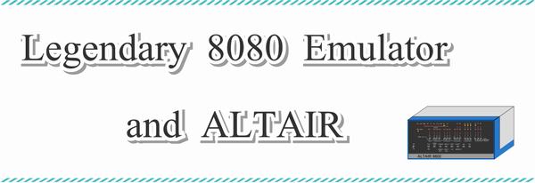
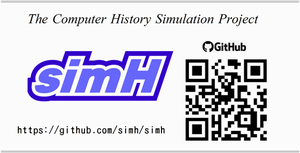

[README in English](./README.md)

legend-emu80
============

Legendary 8080 emulator running on PDP-10.

PDP-10で実行する伝説の8080エミュレーターです。

マイクロソフトを創業したビル･ゲイツと相棒である
ポール･アレンが**Altair BASIC**を開発するときに
活用したPDP-10マシンで動作する伝説の8080エミュレーター
を再現しています。

## Description

『超マシン復活 #4 DEC TOPS-20 伝説の8080エミュレーターとALTAIR』に
掲載のソースコード一式があります。

この本の内容を以下に示します。

- ポール･アレン自身が書いた著書『ぼくとビル･ゲイツとマイクロソフト』を
  引用して、ふたりの大冒険と題してAltair BASIC開発の秘話を紹介します。
- PDP-10マシンのアセンブラ言語で8080エミュレーターを作成します。
- 8080アセンブラ言語の少し実用的なプログラム例として数式電卓を作ります。
- PDP-10マシンの8080エミュレーターでこの数式電卓を実行します。
- PDP-10マシンから8080オブジェクトコードを出力します。
- Altairマシン用のブートストラップローダを作成します。
- Altairマシンで8080オブジェクトの数式電卓を実行します。

## Contents

| No. | Directory                  | Explanation               | Chapter    | Platform
|:---:| -------------------------- | ------------------------- | ---------- |----------------------
|  1  | 01_experimental_emulator   | 実験的なエミュレーター    | 第3章 3.4  | PDP-10 TOPS-20
|  2  | 02_legendary_8080_emulator | 伝説の8080エミュレーター  | 第4章,第6章| PDP-10 TOPS-20
|  3  | 03_formula_calculator      | 8080数式電卓              | 第5章      | PDP-10 TOPS-20
|  4  | 04_calc_lex_yacc           | 数式電卓 lex / yacc       | 第5章 5.1  | Linux
|  5  | 05_boot_loader             | Altair ブートローダー     | 第7章 7.3  | Altair simH
|  6  | 06_simH_altair             | Altair simH ブート一式    | 第7章 7.4  | Altair simH

- 01 [実験的なエミュレーター](./01_experimental_emulator/README-ja-01.md)
- 02 [伝説の8080エミュレーター](./02_legendary_8080_emulator/README-ja-02.md)
- 03 [8080数式電卓](./03_formula_calculator/README-ja-03.md)
- 04 [数式電卓 lex / yacc](./04_calc_lex_yacc/README-ja-04.md)
- 05 [Altair ブートローダー](./05_boot_loader/README-ja-05.md)
- 06 [Altair simH ブート一式](./06_simH_altair/README-ja-06.md)

## Requirement

### PDP-10

**PDP-10**は現存していません。
LinuxマシンでKLH10エミュレーターを実行して
PDP-10マシン TOPS-20 OSを実行します。
[Panda TOPS-20 Distribution](http://panda.trailing-edge.com/)を使用します。

### Altair

**Altair**も現存していません。
LinuxマシンでAltairシミュレーターを実行して
8080バイナリーコードを実行します。
[simH](https://github.com/simh/simh)というマルチシステムシミュレーターを
使用してAltairマシンをシミュレートします

## Licence

Copyright (c) 2022 yuki

[MIT Licence](https://opensource.org/licenses/mit-license.php)

## Author

Yukio Takase  [Yuki Github](https://github.com/Yuki-book)

[ある計算機屋さんの手帳](http://my-web-site.iobb.net/~yuki/)

## References

### 超マシン復活 #4 DEC TOPS-20 伝説の8080エミュレーターとALTAIR

[AMAZON 超マシン復活 #4](https://www.amazon.co.jp/dp/B0B137CCNB/)

