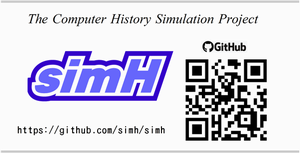

[README in Japanese is here](./README-ja.md)
________________________________________________

legend-emu80
============

Legendary 8080 emulator running on PDP-10.

It recreates the legendary 8080 emulator that 
runs on the PDP-10 machine that Microsoft founder Bill Gates 
and his buddy Paul Allen used to develop **Altair BASIC**.

## Description

**legend-emu80** On Github,
The main source code published in 
"Super machine revival #4 DEC TOPS-20 Legendary 8080 emulator and ALTAIR" 
is available.

The contents of this book are shown below.

- Citing Paul Allen's own book, 
  "Idea Man : A Memoir by the Cofounder of Microsoft" 
  I'll share the secret story behind the development 
  of Altair BASIC under the title of Their Great Adventure.
- Create an 8080 emulator in the assembler language of the PDP-10 machine.
- Let's make a "Formula Calculator" as a slightly practical example 
  of a program in 8080 assembler language.
- Run this "Formula calculator" on the 8080 emulator on PDP-10 machine.
- Output the 8080 object code from the PDP-10 machine.
- Create a bootstrap loader for Altair machine.
- Run the 8080 Object "Formula Calculator" on Altair machine.

## Contents

| No. | Directory                  | Explanation                                  | Chapter        | Platform
|:---:| -------------------------- | -------------------------------------------- | -------------- |----------------------
|  1  | 01_experimental_emulator   | Experimental emulator                        | Chapter 3 3.4  | PDP-10 TOPS-20
|  2  | 02_legendary_8080_emulator | Legendary 8080 emulator                      | Chapter 4 and 6| PDP-10 TOPS-20
|  3  | 03_formula_calculator      | Formula calculator written in 8080 assembler | Chapter 5      | PDP-10 TOPS-20
|  4  | 04_calc_lex_yacc           | Formula calculator written in lex / yacc     | Chapter 5 5.1  | Linux
|  5  | 05_boot_loader             | Altair boot loader                           | Chapter 7 7.3  | Altair simH
|  6  | 06_simH_altair             | Altair simH Boot set                         | Chapter 7 7.4  | Altair simH
|  7  | 07_8080emu_prog            | 8080 Emulator & Samples                      | -              | PDP-10 TOPS-20  (i8080)

- 01 -- [Experimental emulator](./01_experimental_emulator/README-ja-01.md)
- 02 -- [Legendary 8080 emulator](./02_legendary_8080_emulator/README-ja-02.md)
- 03 -- [Formula calculator written in 8080 assembler](./03_formula_calculator/README-ja-03.md)
- 04 -- [Formula calculator written in lex / yacc ](./04_calc_lex_yacc/README-ja-04.md)
- 05 -- [Altair boot loader](./05_boot_loader/README-ja-05.md)
- 06 -- [Altair simH Boot set](./06_simH_altair/README-ja-06.md)
- 07 -- [8080 Emulator & Samples](./07_8080emu_prog/README-ja-07.md)

## Requirement

### PDP-10

**PDP-10** does not exist.
Running the KLH10 emulator on a Linux machine will run the TOPS-20 OS on the PDP-10 machine.
Use [Panda TOPS-20 Distribution](http://panda.trailing-edge.com/) package.

### Altair

**Altair** also does not exist.
Run the Altair simulator on your Linux machine to 
run the 8080 binary code.
Simulate an Altair machine using a multi-system simulator 
called [simH] (https://github.com/simh/simh).

## Licence

Copyright (c) 2022 yuki

[MIT Licence](https://opensource.org/licenses/mit-license.php)

## Author

Yukio Takase  [Yuki GitHub](https://github.com/Yuki-book)

[A notebook of a computer expert](http://my-web-site.iobb.net/~yuki/)

## References

### Super machine revival #4 DEC TOPS-20 Legendary 8080 emulator and ALTAIR

[AMAZON Super machine revival #4](https://www.amazon.co.jp/dp/B0B137CCNB/)

